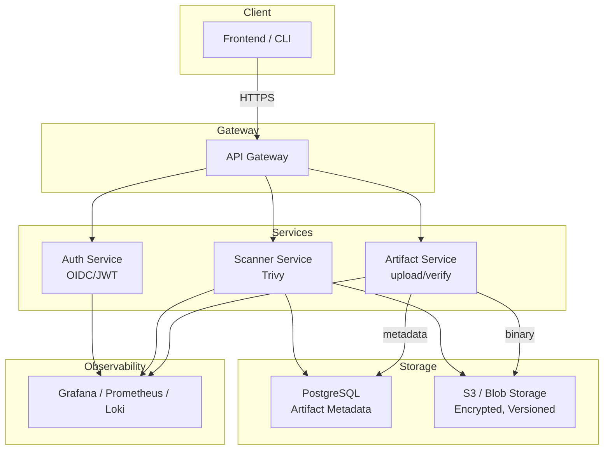
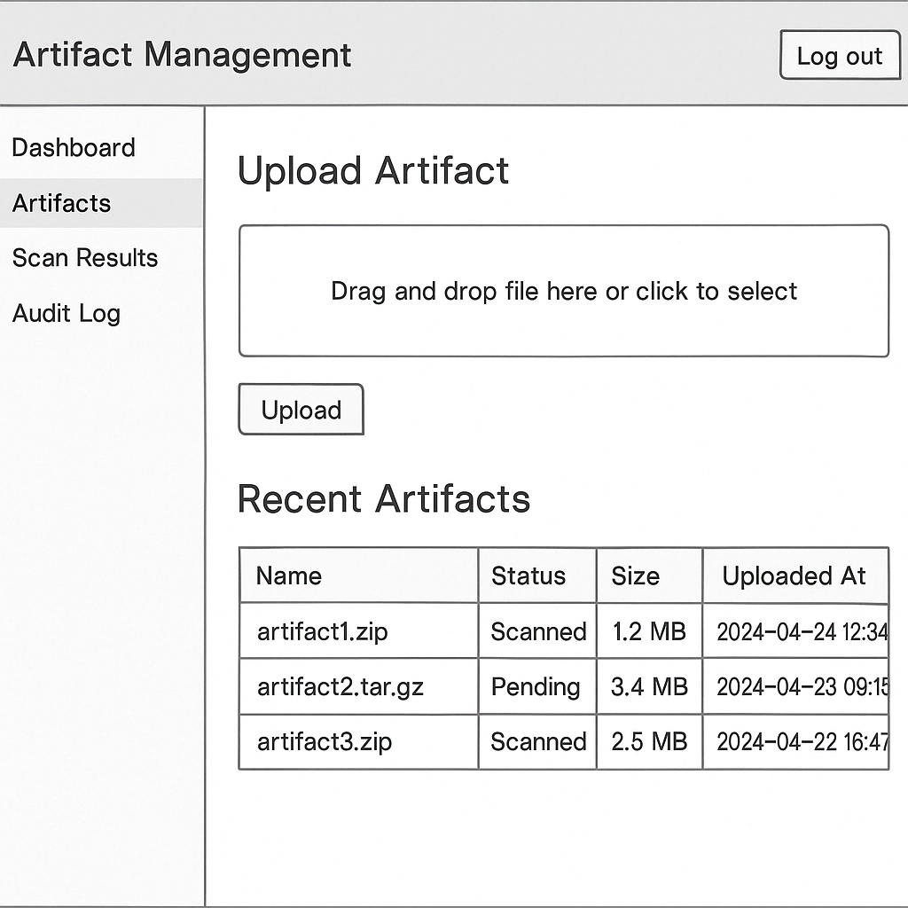

# RFD {0001}: Secure Artifact Manager

## Metadata

- **Author(s):** Aaron Brewbaker
- **Date:** 04-17-2025
- **Status:** prediscussion
- **Target Level:** [1-5]

## Summary

A brief one-paragraph description of the problem being solved and the proposed solution.

Build a secure artifact storage and validation system that allows users to upload, scan, verify, and download binary artifacts with appropriate security guarantees. This challenge assesses your software engineering aptitude, security awareness, collaboration skills, and ability to deploy containerized applications in Kubernetes.

Create a web application that manages binary artifacts (like container images, packages, or executables). The system should track metadata, perform security scans, and provide secure access to these artifacts. Your solution must be containerized and deployable to a local Kubernetes cluster.

## Background and Motivation

Describe the context and motivation for the Secure Artifact Manager. Why is this needed? What problems does it solve for users?

A secure artifact storage and validation system is essential for organizations that rely on binary artifacts in their software development and deployment processes. As the use of containerized applications and microservices continues to grow, so does the need for robust security measures to protect these artifacts from vulnerabilities and unauthorized access.

## Detailed Design

### System Architecture

Outline the high-level architecture of your solution:

#### Component diagram



#### Data flow

- Upload Flow
  - User uploads via UI or CLI → API validates + stores metadata in PostgreSQL
  - Artifact blob saved to S3 bucket
  - Upload triggers scan job via Kubernetes Job
  - Scanner job downloads, analyzes, updates metadata with scan status
- Download Flow
  - User requests artifact → API checks RBAC and scan status
  - API generates time-limited S3 signed URL → user downloads securely
- Logging
  - Every action is logged and traceable (Loki, minio audit logs)
  - Alerts and dashboards powered by Prometheus + Grafana

#### Key technologies and libraries

| Purpose | Technologies/Libraries |
| ------- | ------------------ |
| Frontend | React + TypeScript, Material-UI |
| CLI | Rust |
| Auth | OIDC [keycloak](https://www.keycloak.org/) |
| Core APIs | Rust (Actix-web) |
| Scanner | [Trivy](https://trivy.dev/latest/) |
| Artifact Storage | MinIO |
| Metadata Storage | PostgreSQL |
| Monitoring | Grafana, Prometheus, Loki |
| Containerization | Docker |
| Deployment | Kubernetes, Tanka/jsonnet |
| GitOps | Flux, GitHub, GitHub Actions |

#### API design

- Authentication: JWT Bearer token via OIDC
- Core Endpoints:

    | Method | Endpoint | Description |
    | ------ | -------- | ----------- |
    | POST | /api/v1/artifacts | Upload artifact |
    | GET | /api/v1/artifacts/{id} | Get artifact metadata |
    | GET | /api/v1/artifacts/{id}/download | Download artifact |
    | GET | /api/v1/scans/{id} | Get scan results |
    | GET | /api/audit | Get audit logs |

### Containerization Strategy

Detail your approach to containerization:

#### Container structure and organization

- `artifact-service`
- `scanner-service`
- `auth-service` ? keycloak
- `frontend`
- `nginx`
- `postgresql`
- `minio`
- `prometheus-operator`
- `prometheus`
- `alertmanager`
- `grafana`
- `loki`
- `alloy`

#### Multi-stage build process

All services will use multi-stage builds to:

  1. Compile dependencies and binaries
  2. Copy only what's needed into a minimal runtime image

#### Security hardening measures

- Run containers as non-root users
- Drop linux capabilities (cap-drop)
- Read-only root filesystems
- Use seccomp, AppArmor, and no-new-privileges where supported
- Vulnerability scans via Trivy in CI
- Pin image versions and avoid latest

- Local development setup with Docker Compose (if Level 1)

### Kubernetes Architecture (for Levels 2-5)

Detail your Kubernetes deployment plan appropriate to your target level:

**For Level 2:**

#### Resource organization (namespaces, labels, etc.)

| namespace | purpose |
| --------- | ------- |
| `sam` (secure-artifact-manager) | backend, frontend, scanner |
| `sam-storage` | minio, postresql |
| `monitoring` | prometheus, grafana, loki, alloy |
| `monitoring-storage` | loki pvc, prometheus pvc |
| `auth` | [keycloak](https://www.keycloak.org/), postgresql, oauth2-proxy |
| `ingress` | nginx ingress controller |

- Manifests should have component label

```yaml
metadata:
  labels:
    app: artifact-service
    component: backend
```

- annotation based scraping:

```yaml
annotations:
  prometheus.io/scrape: "true"
  prometheus.io/port: 9000
```

#### Basic deployment manifests approach

- Deployment, Service, Ingress for each component
- scanner should be run via a kubernetes Job, and have a queue
- use tanka/jsonnet for templating
  - tanka used to generate yaml in CI, manifests published as OCI artifacts to ghcr.io via flux

#### ConfigMap and Secret management

- ConfigMaps for non-sensitive data
- Secrets for sensitive data (e.g., DB credentials, API keys)
  - use [SealedSecrets](https://github.com/bitnami-labs/sealed-secrets)

#### Resource limits and requests

- use resource limits/requests to enable HPA
- CPU/Memory requests and limits for each component, e.g.:
  - expiramentation required to find the right values

**For Level 3:**

#### Kind cluster configuration

- multi-node kind cluster with port mappings and local volume mounts
- kind-config.yaml for local development, e.g.

```yaml
kind: Cluster
apiVersion: kind.x-k8s.io/v1alpha4
nodes:
- role: control-plane
  extraPortMappings:
    - containerPort: 80
      hostPort: 8080
      protocol: TCP
    - containerPort: 443
      hostPort: 8443
      protocol: TCP
- role: worker
- role: worker
```

#### Component deployments and their relationships

- artifact service, scanner service, and frontend deployed via Deployment + Service
- PostgreSQL and MinIO deployed as StatefulSets with PersistentVolumes
- Services communicate over internal ClusterIP and environment variables injected via ConfigMaps and Secrets
- Monitoring stack deployed in own namespace.
  - Alloy deployed as DaemonSet for log collection

#### Service definitions and networking approach

- Internal services (artifact service, scanner service, auth, etc) use ClusterIP
- Ingress exposed services (API Gateway, frontend): NodePort via Ingress controller
- DNS-based internal communication iva service names (e.g. artifact-service.sam.svc.cluster.local)

#### Storage requirements and persistent volume strategy

- PersistentVolumeClaim per service
  - PostgreSQL: PVC for metadata DB
  - MinIO: PVC for blob storage (artifacts)
- Local path provisioner for Kind

#### Ingress configuration and TLS

- NGINX ingress controller
- TLS using cert-manager with Let's Encrypt

#### Deployment method (scripts, Helm charts, etc.)

- manifest files generated via Tanka/jsonnet
- CI generates jsonnet --> yaml with tanka, publishes yaml to github container registy as OCI artifacts via flux

**For Level 4:**

#### GitOps implementation details

- FluxCD for GitOps tooling
- Repos:
  - Start with single repo, "sam-core"
    - Contains tanka/jsonnet manifests and all application code
    - could eventually split into multiple repos

#### Advanced security controls

- PodSecurityStandards (PSS): Enforce restricted level via Gatekeeper or built-in PodSecurity Admission
- NetworkPolicies: Restrict service-to-service traffic (e.g., only allow scanner service to access blob storage, deny frontend access to DB)
- Secrets management: Store secrets in SealedSecrets

#### Monitoring and observability setup

- Prometheus operator for metrics collection
  - Use pod based annotation for discovery & scraping initially
- Grafana for dashboards
  - Upload/download throughput
  - Artifact size and scan result trends
  - Scanner queue length
  - API latency and error rates
- Loki for log aggregation
  - logs per pod/user/event
- Alertmanager:
  - SLO alerts, scanning failures, quota exhaustion
  - Example SLOs

    | SLO | Threshold|
    | --- | --- |
    | Upload API success rate | >99.9% |
    | Scan job completion time | < 30 seconds |
    | Time to first byte (download) | < 200ms |
    | Audit log completeness | 100% |

#### Autoscaling configuration

- HPA for:
  - artifact-service (scale on CPU + request latency)
  - scanner-service ([KEDA](https://keda.sh/) with queue-length based autoscaling)
  - possibly needed for auth

#### Backup and recovery strategy

- PostgreSQL:
  - daily dumps wit pg_dump via CronJobs
<!-- TODO: get clarification on expected versioning strategy -->
- S3 / blob storage:
  - bucket versioning enabled
  - lifecycle rules for archiving
- Flux State / Secrets:
  - git is the source of truth
  - SealedSecrets backed up via git

<!-- TODO: more research on velero -->
- Disaster Recovery:
  - cluster snapshots with [Velero](https://velero.io/)?
  - Documented restore playbook(s)

### Data Models

Define the core data models and their relationships:

#### User

```Rust
pub struct User {
    pub id: Uuid,
    pub email: String,
    pub role: String, // "admin", "uploader", "viewer"
    pub created_at: DateTime<Utc>,
    pub last_login: DateTime<Utc>,
}
```

#### ArtifactMetadata

```Rust
pub struct ArtifactMetadata {
    pub id: Uuid,
    pub name: String,
    pub filename: String,
    pub size: i64,
    pub sha256: String,
    pub uploader_id: Uuid,
    pub status: String, // "pending", "scanned", "quarantined"
    pub blob_url: String,
    pub uploaded_at: DateTime<Utc>,
    pub scanned_at: Option<DateTime<Utc>>,
}
```

#### ScanResult

```Rust
pub struct ScanResult {
    pub id: Uuid,
    pub artifact_id: Uuid,
    pub scanner: String,   // "trivy", "grype", etc.
    pub report: String,    // Full JSON report or summary text
    pub status: String,    // "clean", "infected"
    pub created_at: DateTime<Utc>,
}
```

#### AuditLog

```Rust
pub struct AuditLog {
    pub id: Uuid,
    pub user_id: Uuid,
    pub action: String,         // "upload", "download", etc.
    pub artifact_id: Option<Uuid>,
    pub timestamp: DateTime<Utc>,
    pub metadata: serde_json::Value, // Structured audit data
}
```

- use MinIO audit logs when appropriate

### Security Design

#### Authentication and authorization strategy

- OIDC via [keycloak](https://www.keycloak.org/)
- Acccess Tokens:
  - Frontend obtain JWT after login
  - JWTs are passed via Authorization: Bearer token header
- RBAC Enforcement:
  - Roles defined per user: `admin`, `uploader`, `viewer`
  - Middleware validates user claims and role permissions

#### Data encryption (at rest and in transit)

- In transit:
  - all communication via HTTPS (TLS 1.2+)
- At Rest:
  - AES-256 encryption enabled in MinIO
  - PostreSQL uses encrypted volume
  - Secrets encrypted in etcd

#### Secret management

- SealedSecrets for:
  - DB credentials
  - S3/MinIO keys
  - JWT signing secrets

#### Vulnerability scanning implementation

- On artifact upload:
  1. Trigger kubernetes job (scanner pod)
  2. scanner uses Trivy to perform scan
  3. Scan result recorded in DB and used to mark artifact as clean or quarantined
- CICD:
  - app container images scanned as part of build

#### Input validation and security controls

- Enforce file type and size limits
- Sanitize all user-provided metadata fields
- Reject uploads with duplicate SHA256

#### Container security considerations

<!-- TODO: need more research here -->
- Use multi-stage builds to exclude build dependencies
- Run containers as non-root
- Harden with:
  - readOnlyRootFilesystem: true
  - runAsNonRoot: true
  - capDrop: ALL
  - seccompProfile: RuntimeDefault

#### Kubernetes security considerations (if applicable to your level)
<!-- TODO: need more research here -->
- Namespaced deployments with minimal RBAC
- PodSecurity Admission:
  - Enforce restricted PSS level
- Network Policy
  - Deny all by default, explicitly define inter-service communication
- Admission control:
  - Image verification with Cosign
  - Use OPA/Kyverno for policy enforcement
<!-- TODO: OPA/Kyverno may be overkill for this exercise -->

### User Experience

Describe the key user interfaces and flows:

#### Wireframes



#### Key User Interfaces and Flows

Support two primary interfaces

1. Web UI (React + TypeScript)
2. CLI Tool (Rust)

#### Navigation / Web UI

- Dashboard/Home
  - Artifact summary
  - Scan queue
- Artifacts
  - Upload new
  - Browse / Search
  - View Details
- Scan Results
- Audit Logs
  - user activity
  - download logs
- Admin settings
  - user management
  - rbac config
  - links to monitoring dashboards

#### Artifact Upload

1. User logs in via OIDC provider
2. UI/CLI presents a form or prompt to upload an artifact
3. File is selected or path provided
4. Backend computes SHA256, checks for duplication
5. Artifact stored in S3/blob storage, metadata saved in PostgreSQL
6. Scan job is triggered
7. User sees immediate feedback: "Artifact submitted. Scanning in progress."

#### Artifact Download

1. User selects/downloads artifact
2. Backend verifies:
   - User permission
   - Scan status == "clean"
3. API generates secure pre-signed download link
4. User is redirected/downloads file
5. Download event is logged

#### Scan Results

- Users can view scan results per artifact
- Red banner / quarantine flag for infected binaries
- Linked report with details

#### Audit Logs

- Admins can view audit logs; who uploaded/downloaded what and when
- Filterable by user, action, artifact, and timestamp

#### UX for Error Handling

| scenario | behavior |
| -------- | -------- |
| uploads unsupported file type | display clear message with supported types |
| scan failure | warn user, quarantine artifact, show retry option |
| unauthorized download attempt | Display "access denied" or prompt for login |
| artifact quarantined | disable download, display reason / scan report |
| API/server error | show toast or banner: "Unexpected error, try again" |

## Implementation Strategy

Outline your implementation approach:

### Phasing of features

#### Phase 1 (Level 1 - MVP, Basic Functionality)

- Frontend (React/Typescript)
  - file upload and download buttons
  - display uploaded artifacts in a table
  - simple filtering/sorting of artifacts

- Backend (Rust)
  - REST API
    - upload
    - download
    - delete
    - list
  - local filesystem storage
  <!-- - User auth? -->
  - init CLI app "sam" to wrap API
    - sam upload
    - sam list
    - sam delete

- Testing
  - init unit tests for backend
  - init integration test for upload flow

- Containerization
  - Docker files for frontend and backend
  - simple multi-stage builds
  - init docker-compose environment to stand up frontend, backend, and mount directory for local storage

#### Phase 2 (Level 2 - Security Enhancements)

- ArtifactMetadata stored with artifact
  - size, upload timestamp, SHA256 hash, scan_status
  - add deduplication check for SHA256
- Backend Storage
  - init PostgreSQL DB and MinIO DB in docker compose
  - update backend to save artifact metadata to postgresql and artifact binary to minio
- Add scanning of newly uploaded artifact
  - mock scan job and result for now (will add Trivy later)
    - randomize scan_result and/or force statuses in tests
  - init basic display of scan result(s) on frontend
  - save scan results with artifact metadata in postgresql
  - add scan command to CLI

- Improve frontend by adding navigation tabs for:
  - Dashboard (home)
  - Artifacts
  - Scan Results
  - Audit Log
- Add appropriate audit logging for all events
  - display in audit log tab
- Add badge for scan_status to Artifacts table
<!-- TODO: does keycloak impl make sense at this stage? -->
- Init basic auth flow

- Add tests/verification for
  - uploading artifact metadata to postgresql
  - uploading binary to minio
  - user auth and adding user info to postgresql
  - adding scan result to postgresql

- Initial kubernetes deployment setup
  - init kind config
  - init tanka environment for deloying to kind cluster
  - init config.jsonnet for setting up namespaces
  - init manifests for backend & frontend
  - init per service manifests for configmap and secret
  - init manifest for scanner job
  - init manifests for posgresql and minio
- document kind setup & deployment

<!-- - user RBAC roles
- audit logging and download authorization
- Resource limits and requests -->

#### Phase 3 (Level 3 - Advanced Features)

<!-- - local kind cluster support -->
<!-- - persistence and ingress
- secure scanning + quarantine support -->

- Add Artifact signing and verification
  - sign artifacts with [cosign](https://github.com/sigstore/cosign)
- Detailed vulnerability reports
  - display/link full trivy reports on Scan Results page
- Artifact versioning and history
  - enable versioning in minio?
- Advanced filtering and search capabilities
  - add filtering/search to Artifacts, Scan Results, and Audit Log tabs
  - should be able to filter/search by name, SHA256, and time window
- API key authentication option
- Kubernetes:
  - Ingress configuration with TLS
    - add nginx and cert-manager manifests
  - Add health checks and readiness probes
  - Basic network policies
  - Add deployment and helper scripts for tanka
    - tk apply
    - tk show
- Add E2E test script that will:
  - start kind
  - deploy everything
  - test artifact upload
  - shut down

#### Phase 4 (Level 4 - Enterprise Ready)

- Integration with external scanning services
  - Use Trivy to perform scans and replace dummy scan results

<!-- TODO: get clarification
- Compliance reporting and attestations -->
- Approval workflows for artifact promotion
- Performance optimizations for large artifacts?
- Comprehensive security controls
- Kubernetes:
  - Implement GitOps-based deployment Flux
  - Pod security policies or security contexts
  - Add Horizontal Pod Autoscaling
  <!-- TODO: get clarification
  - Custom admission controllers for security -->
  <!-- TODO: need to read more on using velero, unsure of scope -->
  - Backup and disaster recovery strategy
    - Implement chronjob for pg_dump
    - Add playbook(s)
  - Monitoring and alerting configuration
    - init monitoring stack in docker-compose
    - init monitoring stack in tanka
    - ensure users can view grafana and alertmanager
      - config ingress
    - init some basic observability specific to the application
      - upload/download throughput
      - artifact size and scan result trends
      - scanner queue length
      - API latency and error rates
      - alert rules
- gitops with flux
- autoscaling and backup

<!-- TODO: wip, ask for clarification -->
#### Phase 5 (Level 5 - Extra Credit)

- Implement one or more "surprise us" features that demonstrate your unique skills and understanding of the problem space
- Advanced Kubernetes features:
  - Custom Operators
  - Custom Resources Definitions (CRDs)
  - Service mesh integration
  - Multi-cluster deployment strategy
  - Advanced security implementations

### Development priorities

1. upload/download logic with validation
2. secure file storage and checksum verification
3. scanning system integration
4. user role enforcement
5. end-to-end observability
6. secure-by-default deployment (pss, rbac, tls)

### Testing strategy

#### Unit Tests

- rust backend: service logic, validators, scanners

#### Integration Tests

- upload/scan/download flows
- S3 and PostgreSQL interactions

#### E2E Tests

- simulate user upload via cli/ui
- rbac validation?

#### Security Tests

- upload malicious binaries
  - verify scan results and proper quarantine
- bad metadata input

#### CI Pipeline

- rust tests via cargo test
- scan images with Trivy
- linting and formatting

### CI/CD approach (if applicable)

- github actions
  - backend.yml
  - frontend.yml
  - docker-build.yml?
  - tanka.yml
- steps:
  - lint, test, build binaries
  - build container images
  - run trivy
  - push to container registry

### Key milestones

1. Phase 1: mvp with upload/download/list, initial frontend/backend implementation
2. initial DB storage config, user auth
3. test structure in place with unit/integration tests, cli tool used for testing
4. initial kubernetes deployment to kind cluster via tanka
5. CI setup with github actions; build, test, and push container images
6. gitops, monitoring, rbac, hardened environment

## Containerization and Deployment Considerations

Describe your approach based on your target level:

**Level 1 - Containerization:**

- Container image design and optimization
  - multi-stage Dockerfiles
  - small base images (alpine, distroless)
  - config via environment variables

- Docker Compose setup for local development
  - local postgresql, minio, backend, frontend
  - .env for secrets in dev
  - volume mounts for data persistence

- Security considerations for containers
  - non-root containers
  - health checks on services
  - lint dockerfiles with [hadolint](https://github.com/hadolint/hadolint) ?

**Level 2 - Kubernetes Manifests:**

- Manifest organization and structure
  - tanka/environment/production (may not be needed for exercise)
  - tanka/environment/staging (may not be needed for exercise)
  - tanka/environment/kind

- Configuration management
- Manual deployment process
  - scripts for running tk apply to deploy to kind
- Resource management
  - CPU/memory requests and limits per container
  - pod health and readiness probes

**Level 3 - Kind Deployment:**

- Local cluster setup and configuration
  - kind config for multi-node cluster
  - local volume mounts for persistent storage
- Networking and ingress
  - NGINX ingress controller
  - TLS with cert-manager
- Persistence configuration
  - PostgreSQL and MinIO with persistent volumes
  - PVs for loki, possibly prometheus
- Deployment automation
  - tanka/jsonnet for templating
  - deployment scripts for local kind cluster

**Level 4 - GitOps:**

- GitOps tooling and workflow
  - flux for GitOps; CI uses tanka to generate yaml manifests and publish to github container registry via flux
- Continuous deployment strategy
  - dependent on how far we take the implementation, but ideally cutting a release tag should automatically deploy to "production"
<!-- TODO: get clarification on this -->
- Advanced Kubernetes features usage
  - HPA for autoscaling?
    - KEDA & kueue for scanner service?
  - network policies for security
  - pod security policies for compliance
    - gatekeeper?
    - OPA?
    - Kyverno?
  - backup and disaster recovery strategy with Velero?
- Monitoring and observability
  - use kube-prometheus-stack to configure and deploy prometheus operator, prometheus, grafana, and alertmanager
  - use loki for logs with alloy for log collection
  - ideally setup additional repo for dashboards, recording rules, and alerts so grafana can be stateless
  - Use Mimir instead of prometheus, and leverage multi-tenant features of mimir and loki to enhance security and query performance
    - e.g. users are in organizations, organizations are tenants, users queries are automatically restricted to their tenant
      - admin still ablet to perform cross-tenant queries

## Alternative Approaches Considered

Discuss alternative designs you considered and why you chose this approach:

- Rust: [Description] - Pros/Cons
- Go: [Description] - Pros/Cons
- Selected Approach: Rust [Justification]

- Helm: [Description] - Pros/Cons
- Tanka/jsonnet: [Description] - Pros/Cons
- Selected Approach: tanka/jsonnet [Justification]

- Alloy: [Description] - Pros/Cons
- Vector: [Description] - Pros/Cons

## Risks and Mitigations

Identify potential risks and your mitigation strategies:

- Risk 1: [Description] - Mitigation
- Risk 2: [Description] - Mitigation
- Risk 3: [Description] - Mitigation

## Open Questions

List any questions you have for the review team or areas where you're seeking input:

1. What file types do we intend to support?
2. How should we handle large artifacts? Are there size limits?
3. How far should we take the implementation / what is our user base or target audience?
4. Related to #3, what is the expected scale of the system? How many artifacts and users? It's difficult to have sane defaults for requests/limits without knowing the intended scale and/or some experimentation around domain bounds.
5. What is the expected SLA for the system? How quickly do we need to scan artifacts? How quickly do we need to be able to download artifacts? This will help us determine how to configure the system and what our SLOs/SLIs should be.
6. Again related to #3 and how "far" we want to take the implementation - If this were a true production system we would want caching and/or a CDN in front of the S3 storage. Do we want to implement this? If so, how do we want to handle caching? Do we want to use a CDN like Cloudflare or Fastly, or do we want to use something like Redis or Varnish in front of the S3 storage? Or both? Also, to scale and improve performance we would likely want to create a CQRS system with read replicas of the PostgreSQL database. Do we want to implement this? If so, how do we want to handle replication?
7. How do we want to handle versioning of artifacts? We can get "versioning" out of the box with minio, but that's not the same as having a versioning strategy for artifacts. Do we want to version artifacts based on SHA256, or do we want to have a version number that is separate from the SHA256? This could be a simple string field in the metadata table.

## Success Metrics

How will you measure the success of your implementation?

<!-- TODO: wip; need clarification here but some of this could be covered by hitting SLOs/SLIs for system components -->
- Metric 1: [Description]
- Metric 2: [Description]
- Metric 3: [Description]

## References

- [Link to relevant documentation]

### links for tooling

- [PostgreSQL](https://www.postgresql.org/)
- [MinIO](https://min.io/)
- [KEDA](https://keda.sh/)
- [kueue](https://github.com/kubernetes-sigs/kueue)

#### SecOps

- [cosign](https://github.com/sigstore/cosign)
- [Trivy](https://trivy.dev/latest/)
- [Kyverno](https://kyverno.io/)

#### Secrets & Auth

- [keycloak](https://www.keycloak.org/)
- [SealedSecrets](https://github.com/bitnami-labs/sealed-secrets)

#### CICD

- [flux](https://fluxcd.io/flux/)
- [flux OCI](https://fluxcd.io/flux/cheatsheets/oci-artifacts/)
- [Github Actions](https://docs.github.com/en/actions)
- [Hadolint](https://github.com/hadolint/hadolint)

#### Monitoring

- [kube-prometheus-stack](https://github.com/prometheus-community/helm-charts/blob/main/charts/kube-prometheus-stack/README.md)
- [Grafana](https://grafana.com/)
- [Prometheus](https://prometheus.io/)
- [Loki](https://grafana.com/oss/loki/)
- [Alloy](https://grafana.com/docs/alloy/latest/)

- [Link to research materials]
- [Other references that informed your design]
